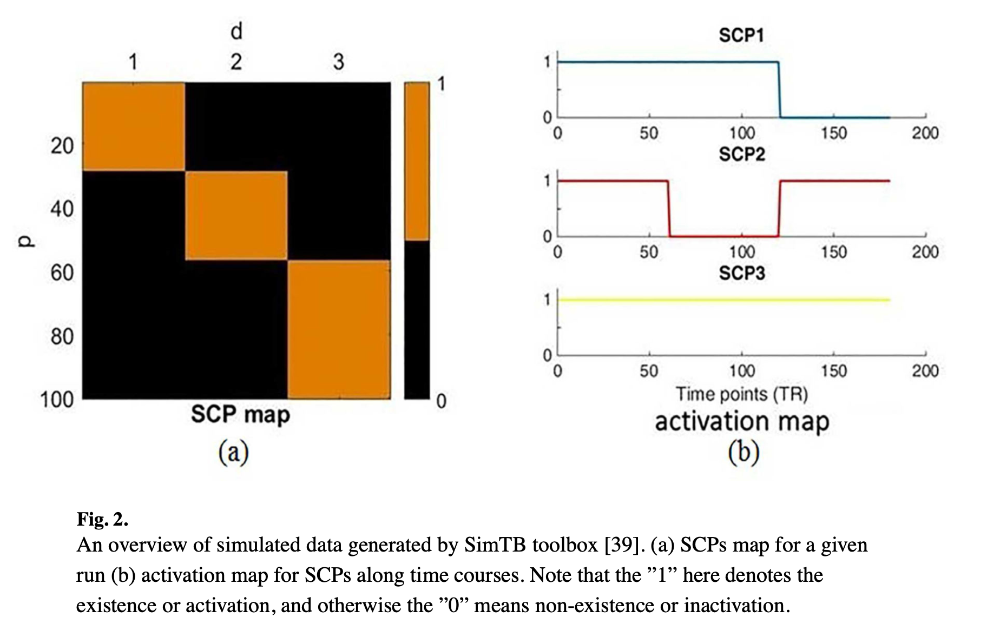
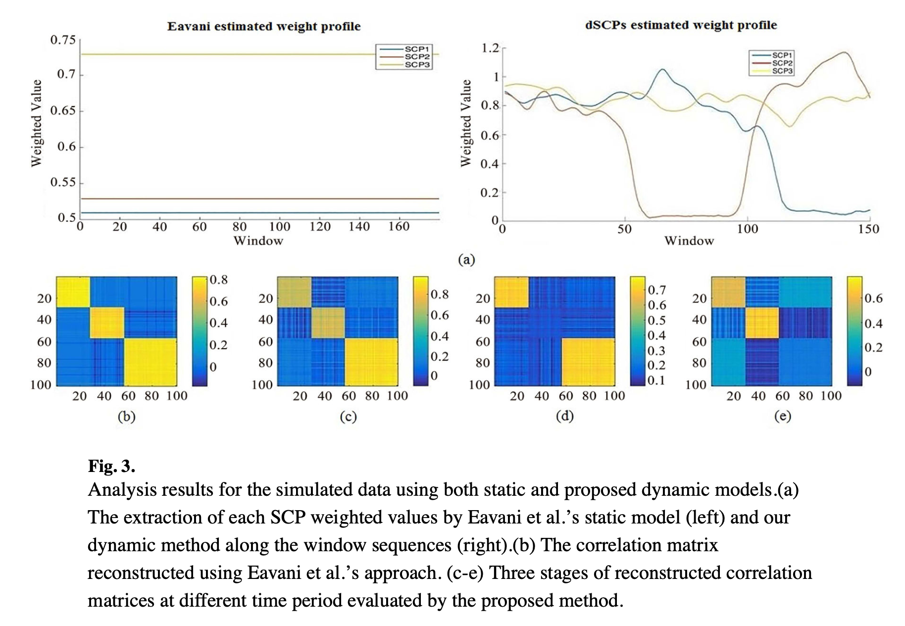
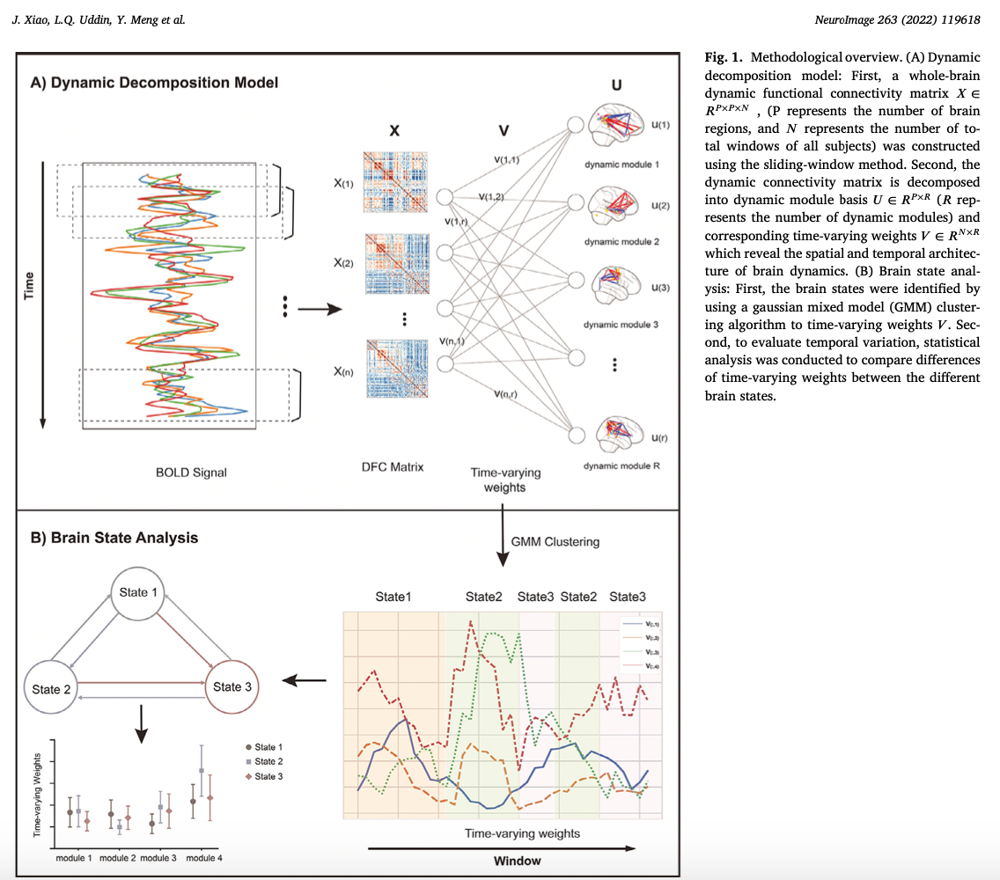

**[Estimation of Dynamic Sparse Connectivity Patterns From Resting State fMRI](https://www.ncbi.nlm.nih.gov/pmc/articles/PMC7640371/), B. Cai, P. Zille, J. M. Stephen, T. W. Wilson, V. D. Calhoun, Y. P. Wang, IEEE Transactions on Medical Imaging, Vol. 37, No. 5, May 2018**

Présenté par : C. Meillier 

 ATTENTION :  un certain nombre d'erreurs dans les indices de somme mais aussi dans les étapes des algorithmes a été relevé dans cet article, la description suivante est une tentative de remettre en forme ce que les auteurs expriment dans le texte. 

### Notations :
SCP = Sparse Connectivity Pattern  
$$n$$ = nb de sujets  
$$n_t$$ = nb d'échantillons temporels   
$$p$$ = nb de ROIs   
$$d$$ = nb de SCPs   
$$n_w$$ = nb de fenêtres temporelles glissantes
$$C_{i,w}$$ = matrice de corrélation du sujet $$i \in \{1,..., n\}$$ calculée sur la fenêtre temporelle $$w \in \{1 .. n_w\}$$

### Modèle proposé :

$$ \underset{x\in \mathbb{R}^{p\times d}, W}{\mathrm{min}} \frac{1}{2} \sum_{i = 1}^{n}\sum_{w = 1}^{n_w} \| C_{i,w} - xW_{i,w}x^T \|_F^2 + \lambda \|x \|_1 \\
\mathrm{s.t.~~} \|x_j \|_\infty = 1, j = 1, \dots, d  \\
\mathrm{~~~~} W_{i,w} \geqslant 0, \forall i = 1, \cdots, n, w = 1, \dots, n_w$$

Dans ce modèle la matrice $W_{i,w}$ est une matrice diagonale de taille $d\times d$ indiquant la contribution de chaque SCP à l'instant $w$ donné chez l'individu $i$. On peut alléger l'équation en réécrivant la double somme comme une seule somme avec un indice $m = 1, \dots, M$ où $M = n*n_w$. Dans le cas d'un sujet unique on aura $n = 1$ et donc $M = n_w$.

### Algorithme : 

Afin de résoudre le problème posé ci-dessus, les auteurs proposent une estimation séquentielle des SCPs : 

> Initialisation des paramètres : $$l$$, $$\lambda$$ et $$d$$   
> Calcul des matrices de corrélation : $$C_{i,w}$$  
> **pour**  $$r = 1 ... d$$ **faire** :  
> > **si** $$j > 1$$ **alors** :
> > > Calcul des matrices $$W_{i,w}^{1:j-1}$$\\
> > > $$\tilde{C}_{i,w} = C_{i,w} - x_{1:j-1}W_{i,w}^{1:j-1}x_{1:j-1}^T$$\\
> > 
> > **sinon** : 
> > > $$\tilde{C}_{i,w} = C_{i,w}$$
> >       
> > Estimation du SCP $$x_j$$ à l'aide de l'algorithme ADMM\\
> > Normalisation de $$x_j$$ tel que $$\underset{i}{max} |x_j(i)| =1$$\\
> 
> Calcul final des matrices $$W_{i,w}$$   

L'algorithme ADMM utilisé pour estimer le SCP $$x_r$$ est formulé comme un problème sous contrainte de consensus : 

$$\underset{x_j^1,...x_j^M}{\mathrm{min}} \frac{1}{2} \sum_{m = 1}^{M}f(x_j^m) + g(z)\\
\mathrm{s.t.~~} \forall m = 1, \dots, M ~~ x_j^m = z$$  

avec $$z\in \mathbb{R}^{P}$$, $$f(x_j) = \| C_{i,w} - x_j(W_{i,w})_jx_j^T \|_F^2 $$ et $$g(z) = \lambda\|z\|_1 $$

> $$x_j^{m,k+1} = \underset{x}{\mathrm{argmin~}} \left(f(x) + \frac{\rho}{2} \| x - z^k + u^{m,k} \|_2^2 \right), ~\forall m = 1, \dots, M$$   \\
> $$z^{k+1} = \underset{x}{\mathrm{argmin~}} \left(g(z) + \frac{N\rho}{2} \| z - \bar{x}^{k+1}- \bar{u}^{k} \|_2^2\right)$$    \\
> $$u^{m,k+1} = u^{m, k} + x^{m, k+1} - z^{k+1}$$     

L'étape de mise à jour de $x_j$ est une descente de gradient tandis que la mise à jour de $z$ se fait par seuillage doux :

$$z^{k+1} = S_{\frac{\lambda}{N \rho}}\left(\bar{x}^{k+1} -  \bar{u}^{k}  \right)$$ 

### Validation sur données simulées 

Génération de données avec SimTB toolbox développée par Erhardt et al 2012 selon le modèle décrit dans les figures ci-dessous. 

Les paramètres du modèle sont fixés aux valeurs optimales ($$d = 3$$, $$\lambda/p = 0.1$$) et la taille de fenêtre est fixé à $$l = 30$$ échantillons. La discussion sur l'influence des paramètres $$\lambda/p$$ et $$l$$ est faite dans le supplementary materiel mais pas discuté dans le papier. De plus les résultats du papier ne correspondent même pas aux paramètres donnant les résultats optimaux. 

### Validation sur données réelles

Les données  sont issues du jeu de données *The Philadelphia Neurodevelopmental Cohort*  contenant 900 acquisitions IRMf de repos de sujets entre 8 et 21 ans. Les sujets ont été divisés en deux groupes : 
* 240 sujets de moins de 17,5 ans
* 232 sujets de plus de 17,5 ans

En l'absence de vérité terrain, la validation de la méthode est réalisée à travers les performances de classification en deux groupes (SVM) sur les caractéristiques correspondant aux poids de chaque SCP estimés dans $$W_{i,w}$$. De cette façon la valeur optimale du nombre de SCPs est fixée à $$d = 7$$. 

L'étude de l'influence des paramètres $$\lambda/p$$ et $$l$$ est réalisé à travers l'erreur de reconstruction, les SCPs sont appris sur un jeu d'entrainement (une portion des données) puis les poids sont estimés sur des données test avec les SCPs appris (éq. 6 du papier). Cette méthodologie fait l'hypothèse de stationnarité des SCPs, il faut donc s'assurer que le nombre de SCPs utilisés est suffisant pour représenter la variabiltité spatiale mais aussi en terme de valeur de corrélation. 

Pour expliquer les différences trouvées entre les deux groupes, les auteurs font le choix de revenir à la modélisation au niveau des états cérébraux en appliquant un K-moyenne sur la diagonale des matrices $$W_{i,w}$$ estimées. Les centroïdes sont des matrices diagonales $$W_k \in\mathbb{R}^{d\times d}$$ représentant les états cérébraux. Le clustering est effectué séparément sur chaque groupe puis les états sont appariés entre les groupes. Des tests sur les différences des états, sur la durée moyenne passée dans chaque état et sur le temps total passé dans chaque état sont réalisées. 

### Questions : 
* Les SCPs utilisés pour les données synthétiques sont orthogonaux (aucune région ne peut participer à deux SCPs dans ce modèle de données). Comme la méthode proposée estime de manière séquentielle les SCPs, en projetant orthogonalement les données aux SCPs précédemment estimés, l'estimation de SCPs orthogonaux ne peut être que performante sur ce type de données synthétiques. Quelles seraient les performances sur des données synthétiques comme celles que nous proposons, où une région peut appartenir à différentes UCFs (et donc potentiellement à plusieurs SCPs, les rendant non orthogonaux) ? Dans le *supplementary materiel* il y a des résultats sur des données avec des SCPs qui partagent quelques régions, mais pas de conclusion quant à la qualité des estimations. 
* Qu'en est-il sur les données rélles ? Dans l'article les SCPs estimés ne sont pas présentés. Est-ce qu'un SCP peut-être interprété comme un (sous-)réseau fonctionnel, est-ce qu'ils ont du sens biologiquement parlant ? 

### Travaux en lien avec ce modèle :
[ A spatio-temporal decomposition framework for dynamic functional connectivity in the human brain, NeuroImage 2022 ](https://www.sciencedirect.com/science/article/pii/S1053811922007339/pdf) qui utilise un modèle similaire formulé comme une décomposition tensorielle avec une contrainte de parcimonie sur les *modules* de connectivité et un lissage temporel sur les poids des modules. 

**Modèle :**

$$\underset{U\in \mathbb{R}^{p\times d}, V \in \mathbb{R}^{n_t\times d}}{\mathrm{argmin}} \| X - \sum_{r = 1}^d u_r \circ u_r \circ v_r \|_F^2 + \lambda \|U\|_1 + \alpha Tr(V^TLV)\\
\mathrm{s.t.~~} -1 \leqslant u_r(i)\leqslant 1,~~\forall i=1..p\\
\mathrm{~~~~~} max u_r(i) = 1\\
\mathrm{~~~~~} V \geqslant 0$$

où $$X \in  \mathbb{R}^{p\times p \times d}$$

